# Playbook:StudyVerse Walkthrough

Dieses Dokument führt durch die Kernfunktionen der Anwendung.

---

## 1 Nutzverwaltung
**Ziel:** Sicherstellen, dass Authentifizierung und Profileinstellung funktionieren.

### 1.1 Neuen User anlegen
1. Auf **"Registrieren"** klicken.

2. Valide Daten eingeben (Benutzername, E-Mail-Adresse, Passwort, Passwort wiederholen).
> **Hinweis:** mit einem Klick auf das Auge kann man das eingegebene Passwort lesen.

3. Auf **"Zur Fachauswahl"** klicken. 
4. Bereits absolvierte Fächer auswählen.
5. Auf **"Speichern & Fertig"** klicken.

**Erwartetes Ergebnis:** 
User wird eingeloggt und auf das Dashboard/Onboarding weitergeleitet.
---
### 1.2 Userdaten bearbeiten
1. Klick auf "Profil bearbeiten" in der Sidebar links.

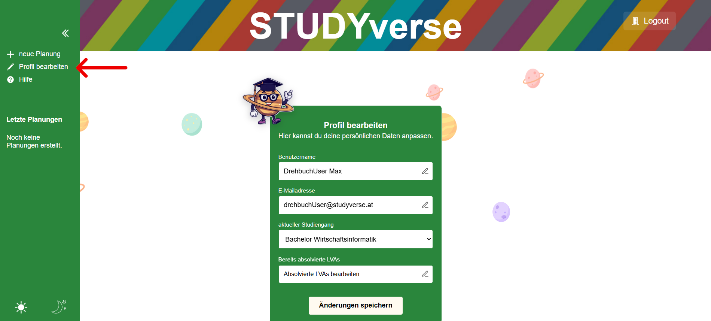

#### 1.2.1 Benutzernamen bearbeiten
2. Ändere den Benutzernamen durch Klick auf den bestehenden Benutzernamen.
3. Speichere die Änderungen mit Klick auf **"Änderungen speichern"**.

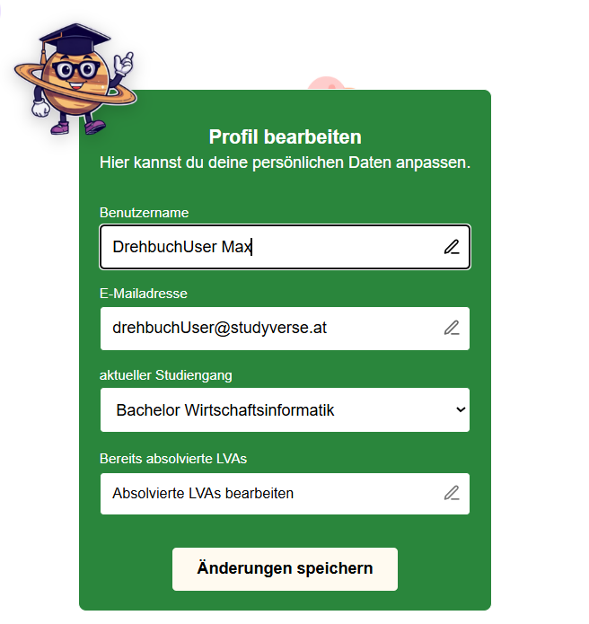

#### 1.2.2 E-Mail-Adresse bearbeiten
2. Ändere die E-Mail-Adresse
3. Speichere die Änderungen mit Klick auf **"Änderungen speichern"**

### 1.3 Absolvierte Lehrveranstaltungen bearbeiten
1. Klicke auf das Feld **"Absolvierte LVAs bearbeiten"**
2. Es öffnet sich eine Liste an Lehrveranstaltungen die im gewählten Studiengang absolviert werden müssen. Mit Klick auf die jeweilige Lehrveranstaltung kann diese ausgewählt werden.
3. Speichere die Änderung mit Klick auf **"Änderungen speichern"**.

> **Hinweis:** Die Liste der Lehrveranstaltungen ist in Gruppen gegliedert. Mit Klick auf die Gruppe können die dazugehörigen Lehrveranstaltungen ein- oder ausgeblendet werden.

**Erwartetes Ergebnis:**
Die soeben durchgeführten Änderungen der Benutzerdaten werden gespeichert.

---
## Nutzerverwaltung
In den bereits absolvierten Lehrveranstaltungen kann der User auswählen welche Lehrveranstaltungen bereits positiv absolviert (oder angerechnet) wurden. Lehrveranstaltungen die in dieser Liste als absolviert ausgewählt sind, werden in der Planung von UNI nicht vorgeschlagen. Außerdem werden die Lehrveranstaltungen bei Voraussetzungsketten für Lehrveranstaltungen die noch abzulegen sind berücksichtigt.

---
### 2.1 Absolvierte LVAs verwalten
1. Klick auf "Profil bearbeiten" in der Sidebar links.

2. Klicke auf "Absolvierte LVAs verwalten"
3. Wähle die bereits positiv abgelegten Lehrveranstaltungen aus.

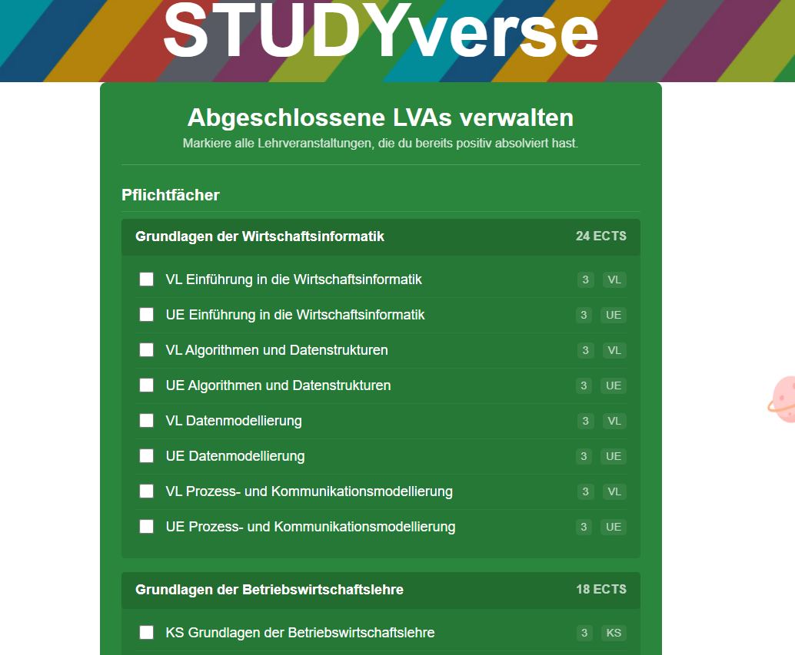

4. Bestätige die Änderung mit Klick auf den Button "Änderungen speichern"

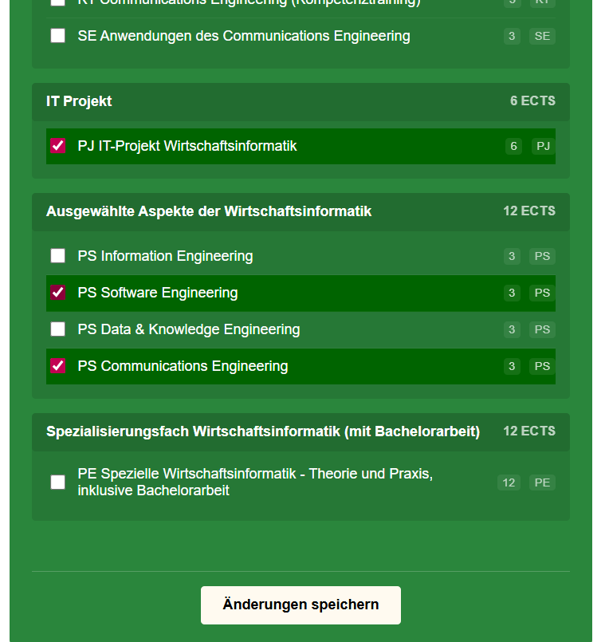

**Erwartetes Ergebnis:**
Die Liste der absolvierten Lehrveranstaltungen ist aktualisiert.
---

## 3 Chat und Planung
### 3.1 Erstellen eines neuen Plans
1. Klicke auf **"neue Planung"** in der Sidebar links.

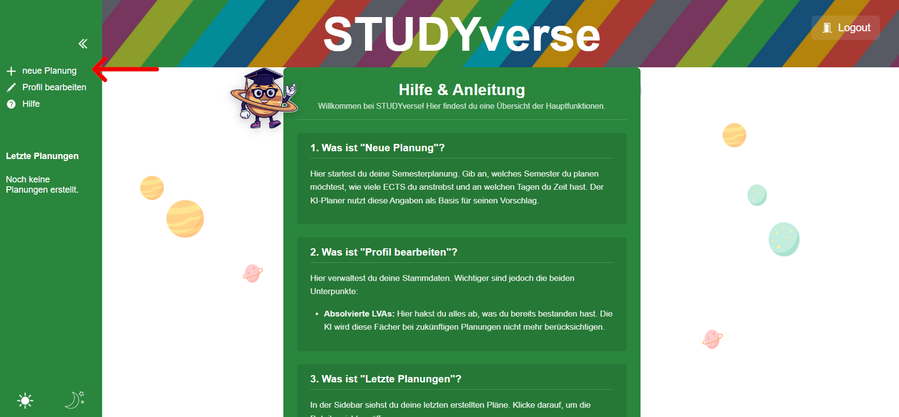

2. Es öffnet sich eine Eingabemaske, fülle dort alle Felder aus. Sobald alle Felder mit validen Eingabewerten befüllt sind, wird **"Planung starten"** klickbar.

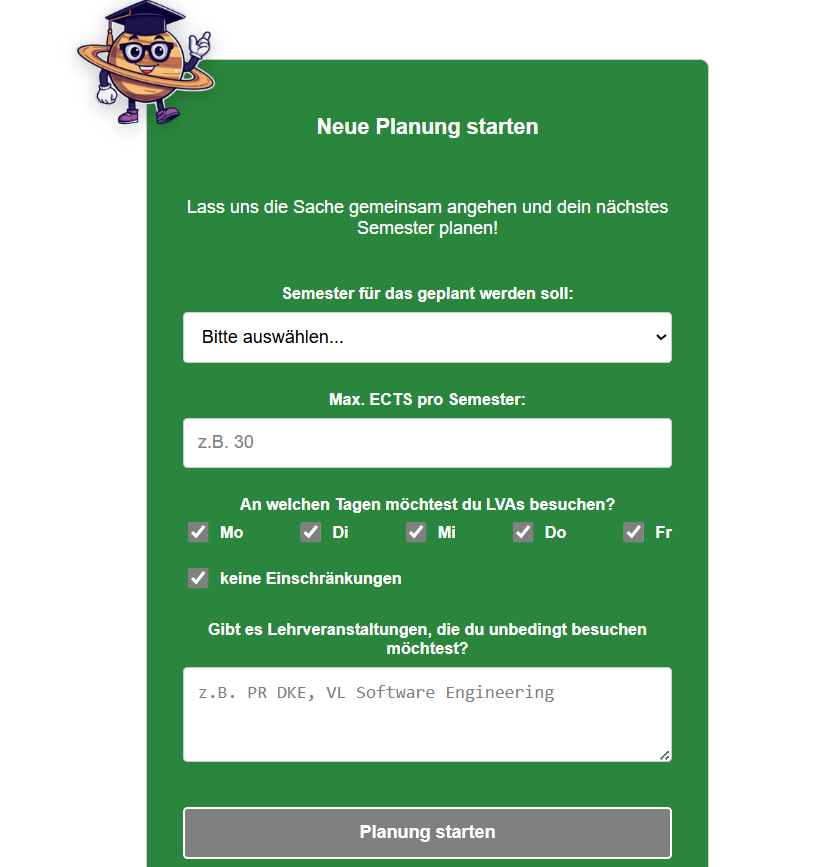

> **Hinweis:** Bei ungültigen Eingabewerten gibt die UI eine entsprechende Rückmeldung.

3. Klicke auf **"Planung starten"**. UNI beginnt nun die Planung mit den angegebenen Daten. Die Erstellung des Planes kann etwas Zeit in Anspruch nehmen.

**Erwartetes Ergebnis:** Es wird ein Plan in Tabellenform angezeigt, die alle geforderten Angaben des Users berücksichtigt.

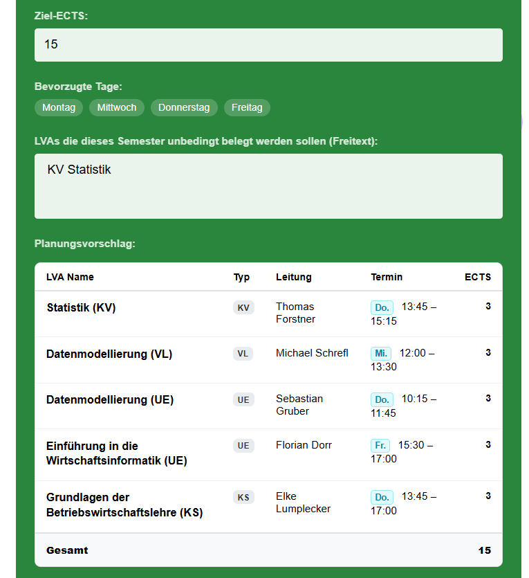
---
### 3.2 Bestehende Planung ansehen
1. Klicke auf eine vergangene Planung. Diese sind in der Sidebar links unter der Überschrift **"Letzte Planungen"** zu finden.
2. Es öffnet sich die ausgewählte Planung.

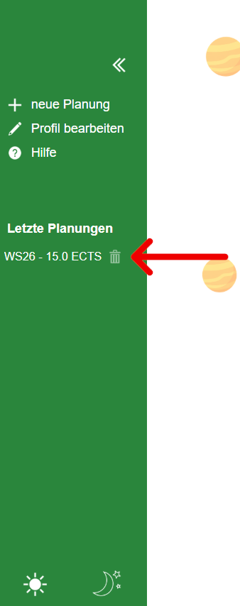

**Erwartetes Ergebnis:**
Die Details der ausgewählten Planung sind sichtbar.
---
### 3.3 Chat mit UNI
1. Öffne eine bestehende Planung 
> **Hinweis:** Man kann den Chat auch gleich nach dem Erstellen eines neuen Plans öffnen
2. Klicke auf **"Chat öffnen"**

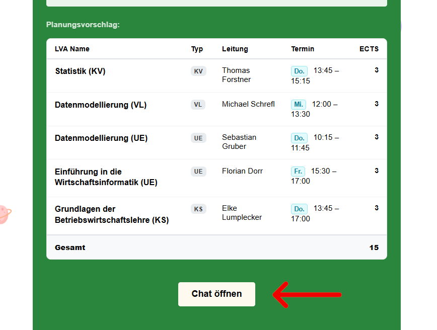

3. Es öffnet sich ein Chatfenster. Innerhalb des Fensters unten gibt es ein Eingabefeld. Stelle hier deine Fragen zum erstellten Plan.

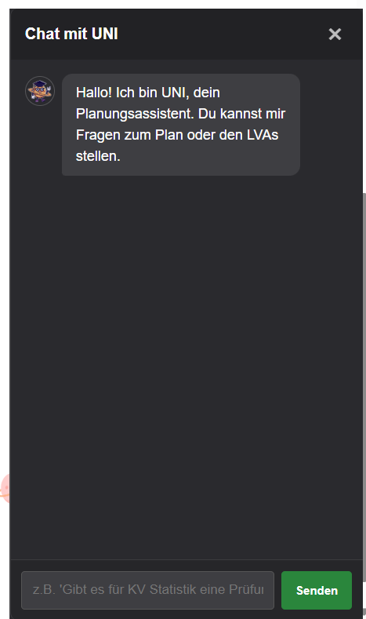

5. Klicke auf den Button "**Senden**". 

**Erwartetes Ergebnis:** UNI gibt eine passende Antwort auf die Frage und die Nachricht ist im Chatfenster sichtbar. Es können weitere Fragen gestellt werden.

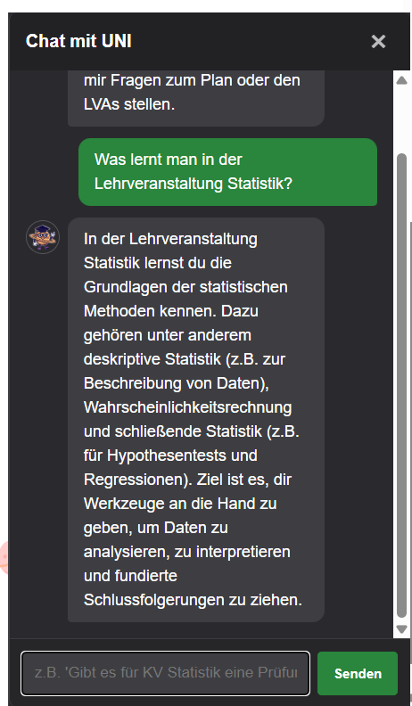

> **Hinweis:** Die Nachrichten im Chat werden gespeichert. Öffnet man den Chat, zu der jeweiligen Planung, sind alle bisherigen Nachrichten sichtbar.
---

### 3.4 Planung löschen
1. Wähle in der Sidebar die Planung die gelöscht werden soll.
2. Neben der Planung gibt es ein **Mülleimer-Symbol**.

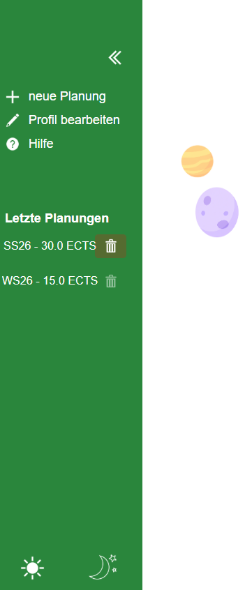

3. Klicke auf das **Mülleimer-Symbol**. Es öffnet sich ein Dialogfeld.
4. Bestätige das Löschen der Planung mit Klick auf "**Löschen**".

**Erwartetes Ergebnis:** Die Planung ist nicht mehr in der Sidebar sichtbar.

## 4 Nebenfunktionen
### 4.1 Sidebar
In der Sidebar können
 - neue Planungen erstellt
 - das Benutzerprofil bearbeitet
 - die Hilfeseite angerufen
 - die aktuellen Planungen abgerufen
 - und das Theme geändert werden.

#### 4.1.1 Sidebar einklappen
1. Klicke in der Sidebar auf das **<<**-Symbol.

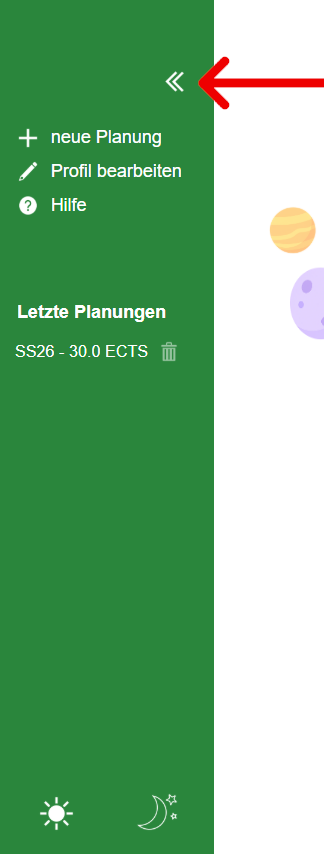

**Erwartetes Ergebnis:** Die Sidebar ist nun eingeklappt.
#### 4.1.2 Sidebar ausklappen
1. Klicke auf das **>>**-Symbol am linken Rand des Bildschirms.

**Erwartetes Ergebnis:** Die Sidebar ist nun ausgeklappt.

### 4.2 Theme ändern
StudyVerse bietet ein helles und ein dunkles Erscheinungsbild.

1. Klicke auf das **Sonnen**- oder das **Mondsymbol** in der Sidebar.

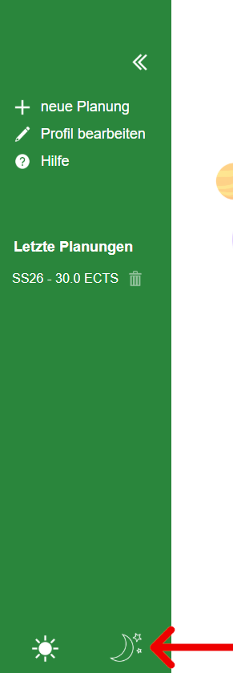

**Erwartetes Ergebnis:**
Das Erscheinungsbild der Anwendung ändert sich in den Tag- oder Nachtmodus.

