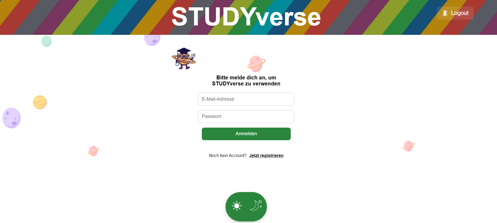
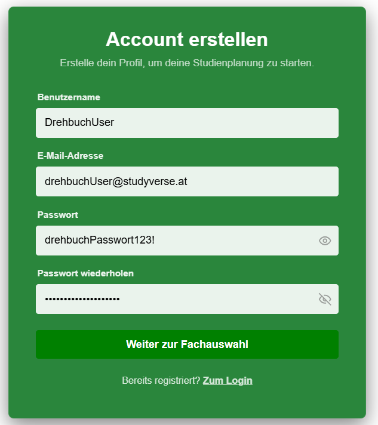
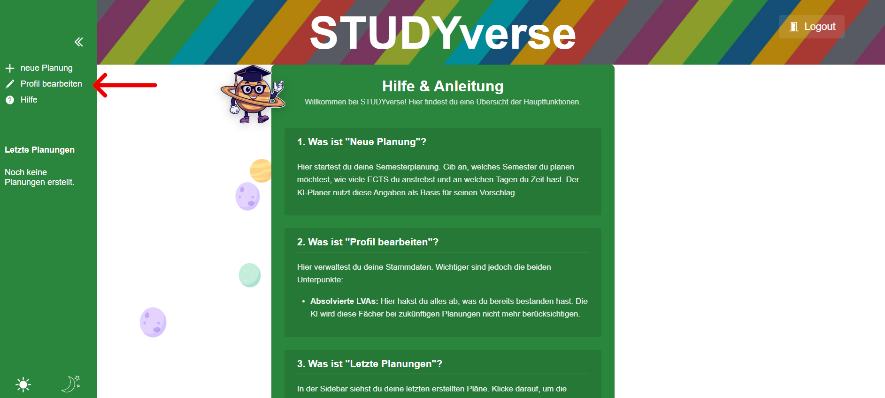
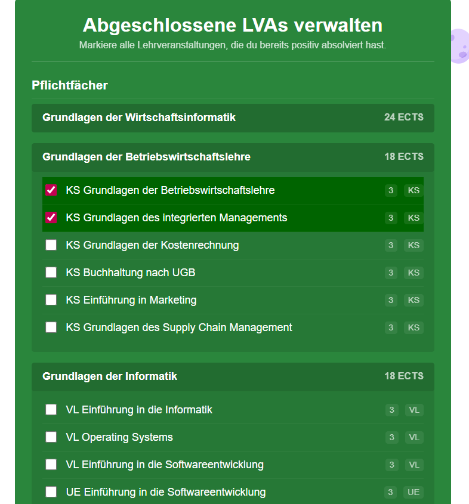
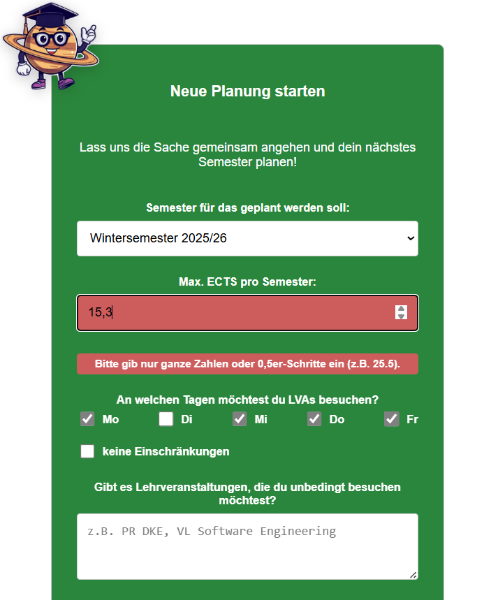
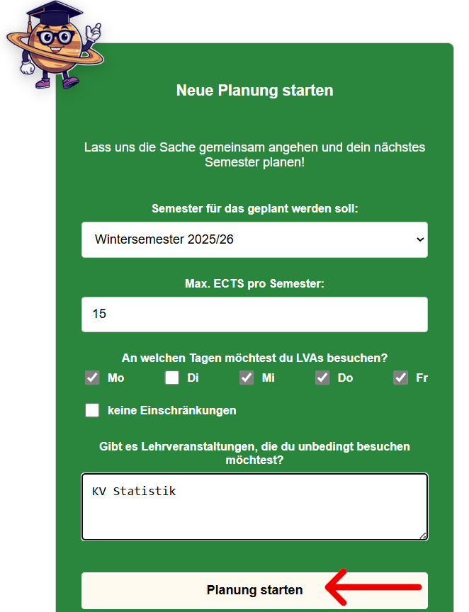
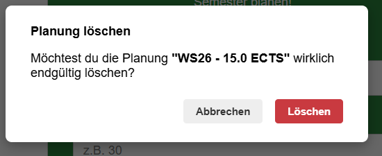
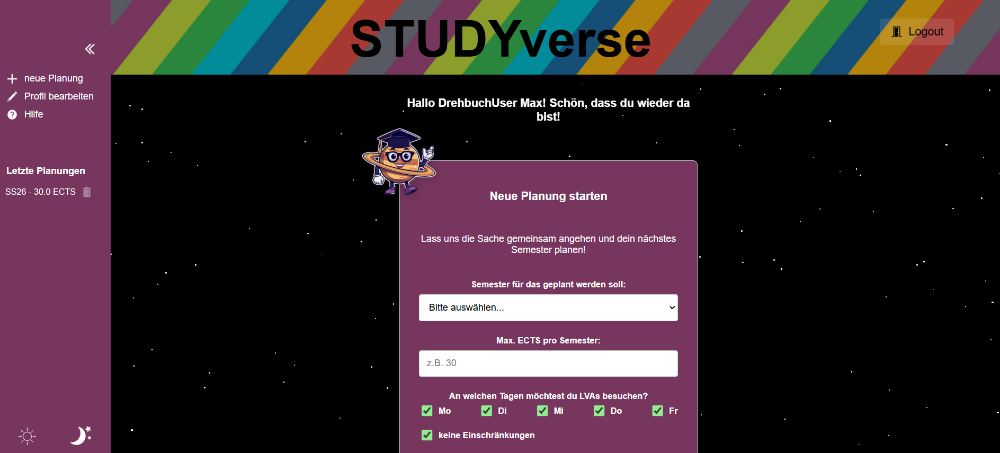
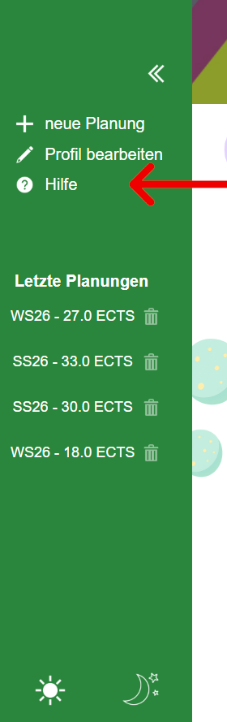

# Benutzer*innen - Handbuch

Willkommen bei StudyVerse - deinem KI-Tool zur Planung deines Semesters.

Ich bin **UNI** und werde dir helfen deinen perfekten Semesterplan zu erstellen.

---

## Inhaltsverzeichnis
- [Einleitung](#einleitung)
- [Anmeldung und Registrierung](#1-anmeldung-und-registrierung)
  - [Neuen User anlegen](#11-neuen-user-anlegen)
  - [Anmeldung](#12-anmeldung)
- [Profil bearbeiten](#2-profil-bearbeiten)
  - [Benutzernamen bearbeiten](#21-benutzernamen-bearbeiten)
  - [E-Mail-Adresse bearbeiten](#22-e-mail-adresse-bearbeiten)
  - [Absolvierte Lehrveranstaltungen verwalten](#23-absolvierte-lehrveranstaltungen-verwalten)
- [Chat und Planung](#3-chat-und-planung)
  - [Erstellen eines neuen Plans](#31-erstellen-eines-neuen-plans)
  - [Bestehende Planung ansehen](#32-bestehende-planung-ansehen)
  - [Chatfunktion](#33-chatfunktion)
  - [Chat löschen](#34-planung-löschen)
- [Nebenfunktionen](#4-nebenfunktionen)
  - [Sidebar](#41-sidebar)
  - [Erscheinungsbild ändern](#42-erscheinungsbild-ändern)
  - [Hilfe-Seite](#43-hilfe-seite)

---

## Einleitung
StudyVerse ist eine Webanwendung, mit der Studierende der JKU im Bachelorstudiengang Wirtschaftsinformatik, mithilfe 
von UNI (einem LLM) Semesterpläne erstellen können. UNI berücksichtigt dabei die bereits absolvierten Lehrveranstaltungen 
des/der Nutzer*innen, die Wunschtage, die maximalen ECTS und Lehrveranstaltungswünsche.

---

## 1 Anmeldung und Registrierung
### 1.1 Neuen User anlegen
Bei der erstmaligen Verwendung von StudyVerse muss man sich registrieren.
1. Klicke auf **"Registrieren"**. 

2. Gib deine Daten ein. Erforderlich sind Benutzername, E-Mail-Adresse und Passwort.
> **Hinweis:** mit einem Klick auf das Auge kann man das eingegebene Passwort lesen.

3. Klicke dann auf den Button **"Zur Fachauswahl"**.
4. Jetzt kannst du alle Lehrveranstaltungen auswählen, die du bereits erfolgreich absolviert hast, oder die dir angerechnet worden sind.
5. Klicke auf **"Speichern & Fertig"**.

Du wirst nun automatisch auf die Hilfe-Seite von StudyVerse weitergeleitet.

---

### 1.2 Anmeldung
Hast du StudyVerse bereits verwendet, dann kannst du dich mit deiner E-Mail-Adresse und deinem Passwort anmelden.

1. Gib deine E-Mail-Adresse und dein Passwort ein.
2. Klick auf den Button **"Anmelden"**.

Du wirst automatisch weitergeleitet und kannst gleich mit deiner Planung loslegen.

## 2 Profil bearbeiten
Du kannst auch nach der Registrierung deine Daten anpassen. Du kannst deinen Namen, deine E-Mail-Adresse und deine
absolvierten Lehrveranstaltungen bearbeiten.

1. Klick auf "Profil bearbeiten" in der Sidebar links.

## 2.1 Benutzernamen bearbeiten
2. Ändere den Benutzernamen durch Klick auf den bestehenden Benutzernamen.
3. Speichere die Änderungen mit Klick auf **"Änderungen speichern"**.

---

## 2.2 E-Mail-Adresse bearbeiten
2. Ändere die E-Mail-Adresse.
3. Speichere die Änderungen mit Klick auf **"Änderungen speichern"**.

---

## 2.3 Absolvierte Lehrveranstaltungen verwalten
2. Klicke auf das Feld **"Absolvierte LVAs bearbeiten"**
3. Es öffnet sich eine Liste an Lehrveranstaltungen die im gewählten Studiengang absolviert werden müssen.
4. Mit Klick auf die jeweilige Lehrveranstaltung kann diese ausgewählt werden.
   
4. Speichere die Änderung mit Klick auf **"Änderungen speichern"**.
   

> **Hinweis:** Die Liste der Lehrveranstaltungen ist in Gruppen gegliedert. Mit Klick auf die Gruppe können die dazugehörigen Lehrveranstaltungen ein- oder ausgeblendet werden.

---

## 3 Chat und Planung
Das Hauptaugenmerk von StudyVerse liegt auf er Planung von kommenden Semestern. Du kannst UNI auch mehrere Semester in die Zukunft planen lassen.
Beachte dabei aber, dass UNI mit Daten aus der Vergangenheit arbeitet und das tatsächliche Lehveranstaltungsangebot
von der Planung abweichen kann.
> **UNI kann Fehler machen**, verlasse dich also nicht blind auf ihn, sondern prüfe den erstellten Plan unter kusss.at nach.
### 3.1 Erstellen eines neuen Plans
1. Klicke auf **"neue Planung"** in der Sidebar links.

2. Es öffnet sich eine Eingabemaske, fülle dort alle Felder aus. Sobald alle Felder mit validen Eingabewerten befüllt sind, wird **"Planung starten"** klickbar.

> **Hinweis:** Bei ungültigen Eingabewerten gibt die UI eine entsprechende Rückmeldung.

3. Klicke auf **"Planung starten"**. UNI beginnt nun die Planung mit den angegebenen Daten. Die Erstellung des Planes kann etwas Zeit in Anspruch nehmen.

So sieht eine fertige Planung aus:

---

### 3.2 Bestehende Planung ansehen
1. Klicke auf eine vergangene Planung. Diese sind in der Sidebar links unter der Überschrift **"Letzte Planungen"** zu finden.
2. Es öffnet sich die ausgewählte Planung.

---

### 3.3 Chatfunktion
1. Öffne eine bestehende Planung 
> **Hinweis:** Man kann den Chat auch gleich nach dem Erstellen eines neuen Plans öffnen
2. Klicke auf **"Chat öffnen"**

3. Es öffnet sich ein Chatfenster. Innerhalb des Fensters unten gibt es ein Eingabefeld. Stelle hier deine Fragen zum erstellten Plan.

5. Klicke auf den Button "**Senden**". 

> **Hinweis:** Die Nachrichten im Chat werden gespeichert. Öffnet man den Chat, zu der jeweiligen Planung, sind alle bisherigen Nachrichten sichtbar.
---

### 3.4 Planung löschen
1. Wähle in der Sidebar die Planung die gelöscht werden soll.
2. Neben der Planung gibt es ein **Mülleimer-Symbol**.

3. Klicke auf das **Mülleimer-Symbol**. Es öffnet sich ein Dialogfeld.
4. Bestätige das Löschen der Planung mit Klick auf "**Löschen**".

---

## 4 Nebenfunktionen
### 4.1 Sidebar
In der Sidebar können
 - neue Planungen erstellt
 - das Benutzerprofil bearbeitet
 - die Hilfeseite angerufen
 - die aktuellen Planungen abgerufen
 - und das Theme geändert werden.

#### 4.1.1 Sidebar einklappen
1. Klicke in der Sidebar auf das **<<**-Symbol.

---

**Erwartetes Ergebnis:** Die Sidebar ist nun eingeklappt.
#### 4.1.2 Sidebar ausklappen
1. Klicke auf das **>>**-Symbol am linken Rand des Bildschirms.

**Erwartetes Ergebnis:** Die Sidebar ist nun ausgeklappt.

---

### 4.2 Erscheinungsbild ändern
StudyVerse bietet ein helles und ein dunkles Erscheinungsbild.

1. Klicke auf das **Sonnen**- oder das **Mondsymbol** in der Sidebar.

StudyVerse merkt sich deine Einstellung. Beim nächsten Login bleibt das Erscheinungsbild gleich.

---

### 4.3 Hilfe-Seite
Auf der "Hilfe-Seite" findest du noch einmal eine kurze Übersicht über alle Features die StudyVerse bietet.
1. Klicke auf **"Hilfe"** in der Sidebar

